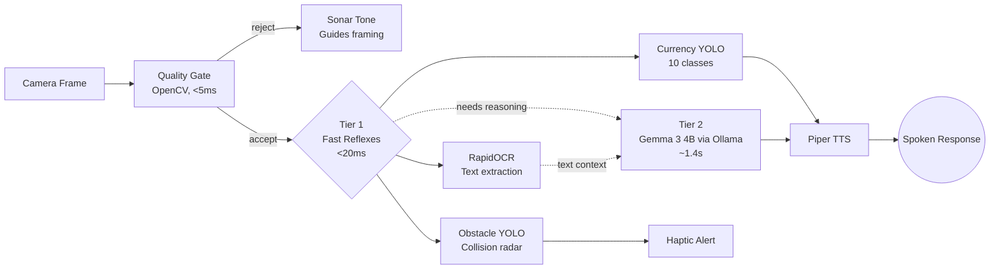

# SETU

**Offline, install-free visual assistance for blind and low-vision users.**

> Team 31 — Gryffindor · RGUKT Srikakulam · Problem Statement #4

A browser (any device, no install) streams camera frames over a WebSocket to a local FastAPI server. Currency, text, and obstacle detection run through small, fast, calibrated models that can abstain when unsure (**Tier 1**). Open-ended scene description and reasoning run through a local vision-language model via Ollama (**Tier 2**). Nothing leaves the machine — no API keys, no network call at inference time, ever.

4.95 crore people in India live with vision impairment — the largest such population of any country — and almost every assistive app built for them assumes a cloud connection they don't reliably have. SETU is built for the moment that connection isn't there.

---

## Why this exists

Most assistive-vision tools are cloud APIs wrapped in an app: point a camera, upload the frame, wait for a server somewhere else to answer. That means a blind user's documents, cash, and home environment leave their device every time they ask a question — and the app stops working the moment the connection does, which for rural and lower-income users is often.

SETU flips that. Every model — vision-language reasoning, object detection, currency recognition, OCR, speech-to-text, and speech synthesis — runs as a local process on the same machine as the camera. Turn off Wi-Fi mid-session and nothing changes. This isn't a fallback mode; it's the only mode.

## What it does

Five voice commands, one interface, zero screen dependency:

| Say this | What happens | Why it matters |
|---|---|---|
| **"currency"** | Detects Indian banknotes, speaks the denominations and total | Cash handling today usually needs a sighted second person |
| **"describe"** | Narrates the scene in front of the camera in plain language | Basic spatial awareness — what room, what's ahead |
| **"read"** | Reads signs, labels, and documents aloud, and answers questions about them | Medicine labels, notices, printed forms |
| **"question"** | Free-form spoken question about whatever the camera sees | Handles anything the fixed modes don't anticipate |
| **"detect"** | Continuously warns of obstacles close in the walking path | Collision avoidance while moving |

All five run through touch gestures too, for anyone who prefers not to speak: double-tap to ask a question, swipe to change screens, two-finger tap to silence, long-press to mute collision warnings.

## Architecture in one paragraph

A browser captures camera frames — 640px for the continuous obstacle scan, 2048px for currency/read/describe — and streams them to a local FastAPI server over WebSocket and REST. Every frame first passes an OpenCV **quality gate** (sharpness, exposure, motion) that also drives a Web Audio sonar tone telling the user how to aim the camera. Frames that pass go to **Tier 1** — a custom-trained currency YOLO, a general obstacle YOLO, and RapidOCR — all under 20ms on CPU. Anything open-ended (scene description, free questions, OCR reasoning) goes to **Tier 2** — Gemma 3 4B running locally through Ollama, at roughly 1.4 seconds per call. Every response, success or failure, resolves to synthesized speech via Piper TTS.



## Why two tiers, not one model for everything

A single vision-language model is flexible but slow and occasionally confident-wrong. A single small detector is fast but has no sense of context. SETU splits by what each is actually good at:

- **Currency has no "not currency" class problem.** A YOLO detector trained only on banknotes will call a human face "100 rupees" at high confidence, because it's never seen a negative example. So Gemma first answers the yes/no question "is currency present," and only then does the trained YOLO count denominations. Two models, each doing the part it's good at.
- **OCR reasoning doesn't need to re-see the image.** Once text is extracted, questions about it ("what's the expiry date?") go to Gemma as plain text — no image re-encoding, answers in under 400ms instead of over a second.
- **Collision detection never waits on a language model.** It's the safety-critical path, so it stays inside the 20ms Tier-1 loop, always running, independent of whatever else the user asked for.

## Quickstart

```bash
./scripts/network.sh          # Network Mode: auto HTTPS + LAN IP for phone access
# or
./scripts/dev.sh              # standard local startup (creates venv, starts server)
```

Open **https://localhost:8443** on this machine, or the printed **Network URL** (e.g. `https://10.10.85.71:8443`) on any phone or tablet on the same Wi-Fi. `getUserMedia` requires HTTPS on mobile browsers — `network.sh` generates trusted multi-IP certificates automatically via `mkcert`.

Run the full stack (all real models, not stubs):

```bash
./scripts/dev.sh --full
```

Installs PyTorch, ONNX Runtime, PaddleOCR, Ultralytics, and faster-whisper (a few hundred MB, needs network for this one-time install).

### What works immediately vs. what needs setup

| Capability | Out of the box | To activate |
|---|---|---|
| Camera streaming, sonar framing guidance | ✅ | — |
| Quality gate (blur / exposure / motion) | ✅ | Tune thresholds in `server/config.py` |
| Currency recognition | Ships pretrained | Works immediately with bundled `currency_best.pt` |
| Obstacle / collision detection | Reports "unavailable" | `pip install -r requirements-full.txt` (Ultralytics — AGPL-3.0) |
| Text reading (OCR) | Reports "unavailable" | `pip install -r requirements-full.txt` (RapidOCR) |
| Scene description / free questions | Reports "unavailable" | Install [Ollama](https://ollama.com), `ollama pull gemma3:4b`, `ollama serve` |
| Speech-to-text | Reports "unavailable" | `pip install -r requirements-full.txt` (faster-whisper) |
| Text-to-speech | Works via macOS `say` (dev fallback) | Drop a [Piper](https://github.com/rhasspy/piper) voice into `models/tts/` |

This isn't a shortcut — it's the same abstention philosophy applied to the whole system. Every unavailable feature says so out loud instead of silently doing nothing or faking a result.

## Performance

Measured on Apple Silicon (M-series, 16GB unified memory), warm (post cold-start):

| Stage | Time | Notes |
|---|---|---|
| Quality gate | 3.8 ms | OpenCV, model-free |
| Currency YOLO inference | 14.2 ms | Custom-trained, 10 classes |
| Obstacle/collision scan | 16.5 ms | YOLO11n, COCO-based |
| OCR extraction | 42 ms | RapidOCR (ONNX) |
| Speech-to-text | 240 ms | faster-whisper, CPU int8 |
| Text-to-speech | 110 ms | Piper Neural TTS |
| VLM scene reasoning | 1,380 ms | Gemma 3 4B via Ollama |
| **End-to-end collision alert** | **~21 ms** | Frame → detection → audio/haptic |
| **End-to-end currency check** | **~1.5 s** | Camera → VLM gate → YOLO → speech |

The first request after server start is 4-5 seconds slower while the language model loads into memory — the server pre-warms this at startup with a dummy inference so it doesn't hit the first real user.

## Model selection — the trade-offs that mattered

Three vision-language models were benchmarked on identical images and prompts before picking one:

- **Moondream 2** — fast (~800ms) but hallucinated: it read a complex IDE window as "a web browser."
- **Qwen2.5-VL 7B** — accurate, but ~51 seconds per query on consumer hardware due to high-resolution token density.
- **Gemma 3 4B** — the only model that was both correct and fast enough for a conversational loop, at ~1.4s average.

OCR went through a similar correction. Tesseract, on a 640px mobile camera frame, extracted 37 characters at 15% confidence — unusable. Swapping to RapidOCR (self-contained ONNX PaddleOCR, no external binary) got 1,398 characters at 68% confidence on the identical frame. That wasn't a tuning improvement; it was the feature going from broken to working.

## Technology stack

| Layer | Technology | Size | Latency |
|---|---|---|---|
| Vision-language reasoning | Gemma 3 4B via Ollama | ~2.5 GB | ~1.4s |
| Currency detection | Custom YOLO11 (10 classes, self-trained on 1,917 images) | 5.5 MB | ~14ms |
| Obstacle detection | YOLO11n (Ultralytics, AGPL-3.0) | 5.6 MB | ~17ms |
| OCR | RapidOCR (ONNX PaddleOCR) | ~14 MB | ~42ms |
| Quality gate | OpenCV / NumPy | model-free | ~4ms |
| Speech-to-text | faster-whisper (`base`, int8) | ~75 MB | ~240ms |
| Text-to-speech | Piper Neural TTS | ~60 MB | ~110ms |
| Backend | FastAPI + Uvicorn + WebSockets | — | — |
| Frontend | Vanilla HTML5 / ES6+ / CSS3, zero build step | — | — |
| Network/TLS | mkcert multi-SAN certificates | — | — |

`ultralytics` is AGPL-3.0 — a deliberate, accepted choice for this public repo. Swap `server/tier1/detect.py`'s interface to an Apache-2.0 or BSD detector if a permissive license is ever required.

## Design principles

1. **Abstain rather than guess.** The system says "I'm not sure, hold it steadier" rather than hallucinate an answer — a wrong confident answer is worse than an honest "I don't know" for a user who can't visually double-check it.
2. **Every failure path ends in speech.** Model error, dropped frame, disconnected network, low confidence — every one of those resolves to a spoken message, never a silent drop.
3. **Zero cloud dependency, by architecture, not by toggle.** No API keys exist anywhere in the codebase. Nothing about a request requires internet at inference time.
4. **Honest degradation over faking it.** A feature that isn't installed says so out loud instead of returning a fabricated result.

## Repository layout

```
server/
  main.py           FastAPI app + WebSocket loop — start here to trace a request
  config.py         every tunable constant, in one place
  ws_protocol.py    the message schema between client and server
  arbiter.py        multi-frame calibration + abstention logic
  tier1/            currency, OCR, obstacle detection, quality gate
  tier2/            local VLM client (Ollama / Gemma 3 4B)
  speech/           STT (faster-whisper) and TTS (Piper / macOS say)
client/
  index.html, app.js, sonar.js, style.css, manifest.json
training/
  train_currency_classifier.py, currency_yolo/, dataset_layout.md
scripts/
  dev.sh, network.sh, gen_certs.sh
models/
  currency_best.pt, yolo11n.pt   (generated / bundled — see models/README.md)
docs/
  SETU_Pitch_Deck_Narrative.md, technical prompts, presentation deck
```

For the full architecture writeup with sequence diagrams and per-feature deep dives, see [overview.md](overview.md). For the pitch narrative and anticipated judge questions, see [docs/SETU_Pitch_Deck_Narrative.md](docs/SETU_Pitch_Deck_Narrative.md).

## Roadmap

- **Standalone mobile app** — the client/model split already exists; porting means a native shell plus on-device runtimes (ONNX Runtime Mobile / Core ML). Currency and obstacle models are already under 6 MB; Gemma 3 4B needs a quantized or smaller variant to fit comfortably on-phone.
- **Local wake-word model** — the browser's Web Speech API is used only for a fixed 5-word command list and may route through the browser vendor on some browsers; a local wake-word model would close that last non-local surface.
- **Counterfeit / damaged-note detection** — explicitly out of scope today; the current model classifies genuine denominations only.
