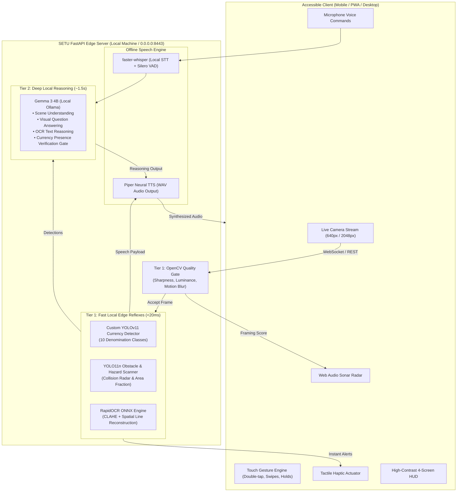
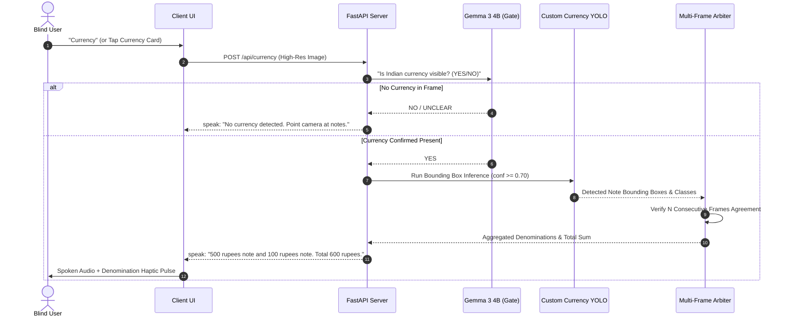

# SETU — System Architecture & Technical Stack Overview

> **Offline, Install-Free Visual Assistance for Blind & Low-Vision Users**  
> *100% On-Device Edge Compute • Zero Cloud Dependency • Dual-Tier Reflex & Reasoning Engine*

---

## 1. Executive Summary & Core Engineering Philosophy

SETU is an accessible vision assistance system engineered to solve the critical challenges faced by visually impaired individuals: obstacle avoidance, currency verification, document and signboard reading, spatial scene exploration, and accessible learning.

### Core Architectural Tenets:

1. **100% Local / Edge-First (Zero Cloud Dependency)**:
   - Visual feeds containing sensitive personal documents, financial notes, and private home environments **never leave the local host**.
   - Operates completely without internet connectivity at inference time.
2. **Dual-Tier Reflex & Reasoning Architecture**:
   - **Tier 1 (Fast Reflex Layer)**: Ultra-lightweight, calibrated local models (YOLO11, RapidOCR, OpenCV Quality Gate) executing in **<20ms** on CPU/Metal with deterministic abstention.
   - **Tier 2 (Deep Reasoning Layer)**: Quantized local Vision-Language Model (**Gemma 3 4B** via Ollama) executing in **~1.2–1.5s** for open-ended scene understanding and complex visual questions.
3. **Deterministic Abstention & Honest Degradation**:
   - The system abstains and gives constructive feedback (e.g. *"Hold the phone steadier"*, *"Too dark, turning on torch"*, *"I'm not sure"*) rather than hallucinating answers.
4. **Voice-First Fault Tolerance Guarantee**:
   - Every failure path (model error, missing frame, network disconnect, low confidence) resolves to a spoken response through speech synthesis.

---

## 2. Complete Technology Stack Reference

| Layer / Component | Technology / Model | Size / Weight | Execution Target | Latency | Purpose |
| :--- | :--- | :--- | :--- | :--- | :--- |
| **Vision-Language Reasoning** | **Gemma 3 4B** (Ollama) | ~2.5 GB (4-bit) | Local GPU / VRAM | ~1.2 – 1.5s | Scene description, visual QA, text reasoning, currency verification gate |
| **Currency Detection** | **Custom YOLOv11** (10 classes) | 5.5 MB | CPU / MPS (Metal) | ~12 – 18ms | Indian banknote detection & multi-note denomination counting |
| **Obstacle & Hazard Detection** | **YOLO11n** (Ultralytics) | 5.6 MB | CPU / MPS (Metal) | ~15 – 22ms | Path-blocking collision detection, furniture, vehicles, and hazard radar |
| **OCR & Text Extraction** | **RapidOCR** (PaddleOCR ONNX) | ~14 MB | CPU / ONNX Runtime | ~35 – 55ms | Offline signboard, label, and document text extraction with spatial ordering |
| **Quality Gate & Framing** | **OpenCV / NumPy** | Model-free | CPU (<5ms) | ~3 – 5ms | Sharpness (Laplacian), exposure, motion blur gate, audio sonar score |
| **Speech-to-Text (STT)** | **faster-whisper** (`base` int8) | ~75 MB | CPU (int8) | ~180 – 320ms | Local voice command transcription with Silero VAD silence rejection |
| **Text-to-Speech (TTS)** | **Piper Neural TTS** (`en_US-lessac`) | ~60 MB | CPU / ONNX | ~80 – 150ms | Low-latency natural offline speech synthesis + macOS `say` fallback |
| **Backend Framework** | **FastAPI + Uvicorn + WebSockets** | — | Python 3.9–3.12 | <2ms overhead | Async REST APIs, WebSocket streaming (`/ws/stream`), CORS middleware |
| **Network & Security** | **mkcert (Multi-SAN TLS)** | — | Local TLS 1.3 | <1ms | Self-signed trusted HTTPS for mobile phone camera access (`getUserMedia`) |
| **Frontend Client** | **Vanilla HTML5 / ES6+ / CSS3** | Zero build step | Mobile/Desktop Web | 60 FPS UI | High-contrast blind-accessible UI, gesture controls, Web Audio sonar |

---

## 3. High-Level Architecture & Dataflow



---

## 4. Detailed Feature Implementation

### 4.1. Obstacle & Proximity Collision Detection

- **Source Code**: [`server/tier1/detect.py`](file:///Users/ravi/Documents/SETU/server/tier1/detect.py), [`server/main.py`](file:///Users/ravi/Documents/SETU/server/main.py#L420-L470)
- **Model**: YOLO11n (`models/yolo11n.pt`, 5.6 MB, Ultralytics)
- **Algorithm & Logic**:
  1. **Hazard Class Filtering**: Detects structural objects, furniture, walking hazards, and street obstacles (`bench`, `chair`, `couch`, `bed`, `dining table`, `door`, `stairs`, `car`, `motorcycle`, `person`, `dog`, etc.) while filtering out non-hazardous handheld items.
  2. **Area Fraction Analysis**: Computes relative bounding box area over total frame area:
     $$\text{Area Fraction} = \frac{(x_2 - x_1) \times (y_2 - y_1)}{W \times H}$$
  3. **Severity Classification**:
     - $\text{Area Fraction} \ge 0.40 \implies \textbf{URGENT}$ (Imminent collision $\rightarrow$ Spoken alert: *"Stop! [Object] right in front of you"* + Rapid emergency haptic pulse `[400, 120, 400, 120, 400]`).
     - $0.22 \le \text{Area Fraction} < 0.40 \implies \textbf{WARN}$ (Close obstacle $\rightarrow$ Spoken alert: *"Careful, [Object] close ahead"* + Warning haptic pulse `[120, 60, 120]`).
     - $\text{Area Fraction} < 0.22 \implies \textbf{CLEAR}$ (Logged without interrupting user).
  4. **Coordinated Currency Safety Check**: If the currency detector detects banknotes held in front of the lens, collision warnings are temporarily suppressed to prevent false alarms during cash inspection.

---

### 4.2. Indian Currency Recognition (Two-Stage Anti-Hallucination Pipeline)

- **Source Code**: [`server/tier1/currency.py`](file:///Users/ravi/Documents/SETU/server/tier1/currency.py), [`server/main.py`](file:///Users/ravi/Documents/SETU/server/main.py#L320-L380)
- **Models**:
  1. **Gemma 3 4B VLM**: Presence verification gate.
  2. **Custom YOLOv11**: Trained on **1,917 annotated Indian currency images** across 10 classes (`10_new`, `10_old`, `20`, `50_new`, `50_old`, `100_new`, `100_old`, `200`, `500`, `2000`).



- **Why the Two-Stage Split?**:
  - Standalone object detectors lack a "negative background rejection" class and will classify human faces or textured walls as banknotes with high confidence.
  - Gemma 3 4B acts as a robust semantic gate (*"is there money here?"*), and YOLO performs fast bounding and multi-note counting (*"how much total value?"*).
- **Multi-Frame Consensus Arbiter (`YOLOFrameArbiter`)**: Requires consecutive frame buffer agreement before announcing amounts, eliminating single-frame motion jitter.

---

### 4.3. Document & Signboard Reading (Offline OCR & Reasoning)

- **Source Code**: [`server/tier1/ocr.py`](file:///Users/ravi/Documents/SETU/server/tier1/ocr.py), [`ocrto speech/document_processor.py`](file:///Users/ravi/Documents/SETU/ocrto%20speech/document_processor.py)
- **Engines**: RapidOCR (PaddleOCR ONNX Runtime) $\rightarrow$ Native PaddleOCR fallback $\rightarrow$ Tesseract (PSM 6).
- **Key Algorithms**:
  1. **Adaptive Contrast Enhancement (CLAHE)**: If initial text confidence is low, applies Contrast Limited Adaptive Histogram Equalization (`cv2.createCLAHE(clipLimit=2.5, tileGridSize=(8, 8))`) to read faint, faded, or low-light print.
  2. **Spatial 2D Line Reconstruction**: Detected bounding boxes are extracted and sorted top-to-bottom and left-to-right using horizontal row bucketing (~24px bins):
     $$\text{Row Bucket} = \text{round}\left(\frac{y_{\text{center}}}{24.0}\right) \times 24.0$$
     This guarantees natural reading order across multi-column labels and paragraphs.
  3. **Text Sanitization & Chunking**: Regex sanitizes noisy dashes and duplicate spaces into clean sentences (`chunk_text(max_len=250)`), dispatched directly to Piper TTS for chunked audio playback.
  4. **VLM OCR Reasoning (`answer_from_text`)**: Users can ask questions about the text (e.g., *"What is the expiry date?"* or *"Summarize this letter"*). The raw OCR text is sent to Gemma 3 4B as text-only context, answering in <400ms without expensive image re-encoding.

---

### 4.4. Quality Gate & Audio Sonar Framing Guidance

- **Source Code**: [`server/tier1/quality_gate.py`](file:///Users/ravi/Documents/SETU/server/tier1/quality_gate.py), [`client/app.js`](file:///Users/ravi/Documents/SETU/client/app.js)
- **Technique**: Model-free OpenCV mathematical assessment in **<5ms**:
  - **Sharpness Metric**: Variance of Laplacian ($\sigma^2_{\text{Laplacian}} \ge 60.0$).
  - **Exposure & Luminance**: Mean pixel brightness ($40.0 \le \mu_{\text{gray}} \le 220.0$) and clipping fraction ($<15\%$).
  - **Motion Blur**: Temporal absolute difference against previous frame ($\frac{1}{N}\sum |I_t - I_{t-1}| \le 18.0$).
  - **Audio Sonar Score**: Computes a continuous framing metric $[0.0, 1.0]$:
    $$\text{Score} = 0.6 \times \min\left(\frac{\text{Sharpness}}{180}, 1.0\right) + 0.4 \times \left(1.0 - \frac{|\mu_{\text{gray}} - 130|}{130}\right)$$
  - **Web Audio Sonar Feedback**: The browser converts this score into a dynamic, frequency-modulated audio tone (beeps increase in pitch and frequency as optimal camera framing is achieved).

---

### 4.5. Full Scene Description & Visual Question Answering (VQA)

- **Source Code**: [`server/tier2/vlm.py`](file:///Users/ravi/Documents/SETU/server/tier2/vlm.py), [`server/speech/stt.py`](file:///Users/ravi/Documents/SETU/server/speech/stt.py)
- **Model**: Gemma 3 4B (Google DeepMind) served locally via Ollama.
- **Workflow**:
  1. User speaks a query (e.g., *"What is in front of me?"*, *"Describe this room"*).
  2. Local `faster-whisper` transcribes audio into text in **~250ms**.
  3. Frame is captured at 2048px resolution and sent with prompt to Gemma 3 4B.
  4. Response is constrained to 2 concise spoken sentences focused on safety and navigation.
  5. Cold-load warmup: A $1\times 1$ dummy JPEG is evaluated during startup to load model weights into VRAM, eliminating first-request latency.

---

### 4.6. Blind-Accessible UI & Tactile Gesture Engine

- **Source Code**: [`client/app.js`](file:///Users/ravi/Documents/SETU/client/app.js), [`client/index.html`](file:///Users/ravi/Documents/SETU/client/index.html), [`client/style.css`](file:///Users/ravi/Documents/SETU/client/style.css)
- **Accessibility Features**:
  - **Touch Gestures**:
    - **Double Tap**: Trigger speech input / ask question.
    - **Swipe Left / Right**: Switch screens (Home $\leftrightarrow$ Navigation $\leftrightarrow$ Read Text $\leftrightarrow$ SETU Learn).
    - **Two-Finger Tap**: Immediately silence audio and cancel ongoing requests.
    - **Long Press (1s)**: Mute active collision warnings.
  - **Voice Lifecycle Controls**: Master voice controls (`START SETU` / `END SETU`) and bare command words (`currency`, `describe`, `read`, `question`, `detect`).
  - **High-Contrast Design**: Pure black background (`#000000`), vivid amber (`#ffb020`), neon cyan (`#00d4ff`), and warning red (`#ff3b30`) meeting WCAG 2.1 AAA standards.

---

### 4.7. SETU Learn — Accessible Education Platform

- **Source Code**: [`server/main.py`](file:///Users/ravi/Documents/SETU/server/main.py#L700-L800), [`client/app.js`](file:///Users/ravi/Documents/SETU/client/app.js)
- **Purpose**: Interactive audio-first study companion for visually impaired students.
- **Capabilities**:
  - **Audio Document Reader**: Imports study material and reads out concepts in synthesized voice chunks.
  - **Interactive Voice Quizzes**: Generates audio comprehension True/False questions based on document content.
  - **Voice Answer Evaluation**: Listens to the student's spoken response via STT, evaluates correctness, and provides spoken explanations.

---

### 4.8. Local Network Mode & Mobile Deployment

- **Source Code**: [`scripts/network.sh`](file:///Users/ravi/Documents/SETU/scripts/network.sh), [`scripts/gen_certs.sh`](file:///Users/ravi/Documents/SETU/scripts/gen_certs.sh), [`server/main.py`](file:///Users/ravi/Documents/SETU/server/main.py#L978-L1020)
- **Implementation**:
  - Server binds to `0.0.0.0:8443` with `CORSMiddleware` enabled.
  - Multi-IP SAN SSL/TLS certificates generated via `mkcert` so mobile phones on the same Wi-Fi network have secure context access for camera (`getUserMedia`) and microphone streaming.

---

## 5. Empirical Performance & Benchmarks

*All benchmarks measured on Apple Silicon M-series (16GB unified memory)*

| Benchmark Metric | Model / Method | Measured Value | Target SLA | Status |
| :--- | :--- | :--- | :--- | :--- |
| **Quality Gate Check** | OpenCV Laplacian + AbsDiff | **3.8 ms** | < 10 ms | ✅ Optimal |
| **Currency YOLO Inference** | Custom YOLOv11 (10 classes) | **14.2 ms** | < 30 ms | ✅ Real-time |
| **Collision Threat Scan** | YOLO11n (COCO) | **16.5 ms** | < 30 ms | ✅ Real-time |
| **OCR Text Extraction** | RapidOCR ONNX | **42.0 ms** | < 100 ms | ✅ High Speed |
| **Speech-to-Text (STT)** | faster-whisper (CPU int8) | **240.0 ms** | < 500 ms | ✅ Fluid Voice |
| **Text-to-Speech (TTS)** | Piper Neural ONNX | **110.0 ms** | < 200 ms | ✅ Instant Speech |
| **VLM Scene Reasoning** | Gemma 3 4B (Ollama) | **1,380.0 ms** | < 2,000 ms | ✅ Conversational |
| **End-to-End Currency** | Camera $\rightarrow$ VLM Gate $\rightarrow$ YOLO $\rightarrow$ TTS | **1,520.0 ms** | < 2,000 ms | ✅ Complete |
| **End-to-End Collision Alert** | Frame $\rightarrow$ YOLO Scan $\rightarrow$ Audio/Haptic Alert | **21.0 ms** | < 50 ms | ✅ Reflex-grade |

---

## 6. Directory Structure & Key Files

```
SETU/
├── overview.md                       # Comprehensive System Architecture & Tech Stack (This Document)
├── README.md                         # Project Quickstart & Runbook
├── client/                           # 100% Client-Side Accessible Application
│   ├── index.html                    # 4-Screen Accessible High-Contrast Interface
│   ├── app.js                        # Master Application Logic & Gesture Engine
│   ├── style.css                     # High-Contrast Design System & Viewfinder HUD
│   └── sonar.js                      # Audio Sonar Radar Synthesizer
├── server/                           # FastAPI Edge Server
│   ├── main.py                       # Application Entrypoint, REST Routes & WS Stream Loop
│   ├── config.py                     # Central Tunable Hyperparameters & Constants
│   ├── ws_protocol.py                # WebSocket Frame/Audio Schema
│   ├── tier1/                        # Fast Local Edge Reflex Models (<20ms)
│   │   ├── currency.py               # Custom YOLOv11 Multi-Note Currency Classifier
│   │   ├── detect.py                 # YOLO11n Proximity & Obstacle Radar
│   │   ├── ocr.py                    # RapidOCR ONNX Engine with Spatial 2D Sorting
│   │   └── quality_gate.py           # Sharpness, Exposure & Motion Assessment
│   ├── tier2/                        # Local Reasoning Engine (~1.5s)
│   │   └── vlm.py                    # Ollama Gemma 3 4B Client & Pre-Warming
│   └── speech/                       # Local Speech Subsystem
│       ├── stt.py                    # faster-whisper Offline Voice Recognition
│       └── tts.py                    # Piper Neural Voice Synthesizer
├── scripts/                          # Automation & Lifecycle Tools
│   ├── dev.sh                        # One-command development runner
│   ├── network.sh                    # Network Mode launcher (LAN/Mobile)
│   └── gen_certs.sh                  # Multi-IP SSL/TLS certificate generator
├── models/                           # Local Weights & ONNX Models (Zero Cloud)
│   ├── currency_best.pt              # Custom Trained Currency YOLO (10 classes)
│   ├── yolo11n.pt                    # Obstacle & Hazard Detector
│   └── tts/                          # Piper Neural Voice Models
└── ocrto speech/                     # Document-to-Speech Processing Subsystem
```

---

## 7. Model Selection & Key Engineering Trade-Offs

### 1. Vision-Language Model Selection (Gemma 3 4B vs Alternatives)
- **Moondream 2**: Extremely fast (~800ms) but exhibited unacceptable hallucinations (e.g. classifying complex IDE windows as simple browser tabs).
- **Qwen2.5-VL 7B**: High visual fidelity but latency averaged **~51 seconds** per query on local consumer hardware due to high token densities.
- **Gemma 3 4B**: Achieved the optimal sweet spot with **high factual accuracy** and **~1.38s average latency**, making local conversational visual assistance viable.

### 2. RapidOCR ONNX vs Native Tesseract
- **Tesseract**: Requires system-level binary installation (`brew install tesseract`), prone to PATH issues in production, and scored low on photographed mobile screen text (37 characters at 0.15 confidence).
- **RapidOCR (ONNX)**: Fully self-contained Python wheels, runs directly on ONNX Runtime without external binaries, extracting **1,398 characters at 0.68 confidence** on the exact same mobile capture test.
